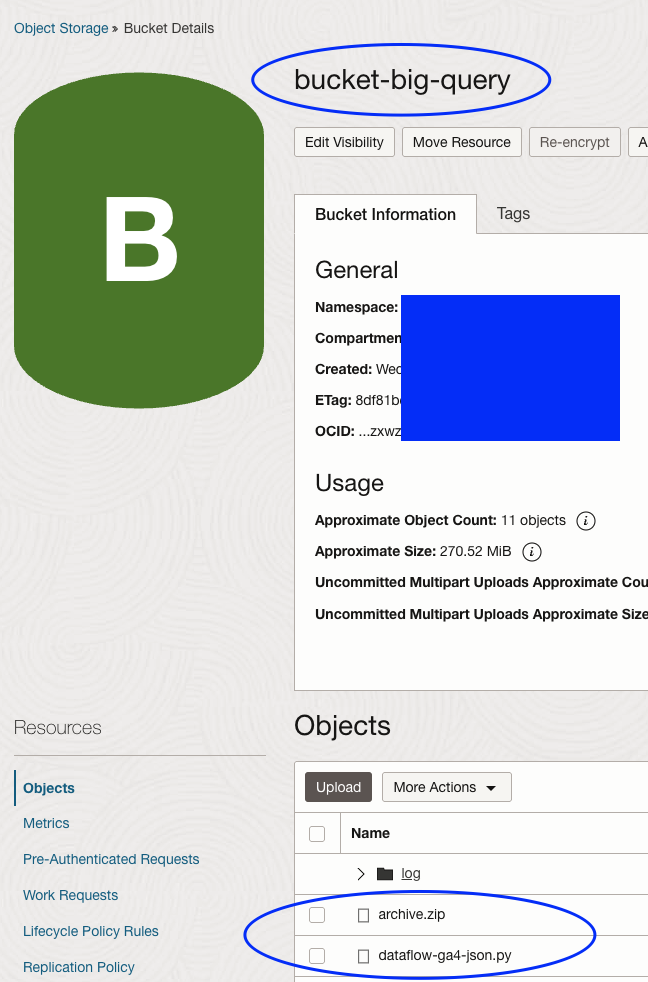

# Google BigQuery to MySQL HeatWave
Reference : [ga4-oci-adb-analytics](https://github.com/nikosheng/ga4-oci-adb-analytics/tree/main)

## 1. Obtain the GCP Service Account credential

#### (1) Refer to this [VIDEO](https://www.youtube.com/watch?v=idoiDI2d3hE) to setup a account.

For more information on how to create service account in GCP, please refer to
    [Create a service account](https://support.google.com/a/answer/7378726?hl=en)

#### (2) Grant acccess

#### (3) Get the KEY JSON file  

    
After retrieving the service account in json format, we need it to be included in the dependencies archive zip file in following step.

## 2. Create Zip Archive to include the OCI Dataflow Dependencies

A `Dependency Archive` is a zip file that contains the necessary dependencies for a running Spark program. In OCI DataFlow, it is recommended to prepare these dependencies in advance and store them in OCI Object Storage. We will create a compressed zip file named `archive.zip` using a Docker-based tool. This `archive.zip` will be installed on all Spark nodes before running the application.

OCI provides `Cloud Shell` for users to prepare the `archive.zip`, and for more instruction information on how to create the zip archive, please refer to 
    [Providing a Dependency Archive](https://docs.oracle.com/en-us/iaas/data-flow/using/third-party-provide-archive.htm#third-party-provide-archive)

If you are using other environments, please ensure to install `docker` before running the following steps.

#### (1) Upload the folder `dataflow_archive_dependencies` to Cloud Shell

#### (2) Check the Cloud Shell Architecture is "X86_64"

    
#### (3) Run the command to provision the `dependency-packager` image to create the zip archive.
    

    docker run --rm --user root -v $(pwd):/opt/dataflow -it phx.ocir.io/axmemlgtri2a/dataflow/dependency-packager-linux_x86_64:latest -p 3.11

Once completed, a zip archive named `archive.zip` will be created. Next, we need to add the GCP service account KEY JSON file to the archive. I suggest unzipping the archive first, placing the service account JSON file in the `python/lib/<service_account>.json` path, and then zipping the folder again with the name `archive.zip`.

#### (4) Upload the `archive.zip` file to OCI Object Storage.

    oci os object put -bn <bucket_name> --namespace <namespace> --name archive.zip --file archive.zip
    

## 4. Create the OCI Dataflow Application

OCI Dataflow is a Spark runtime that allows you to execute your Spark applications in Java, Scala, Python, or SQL. Additionally, the job will terminate all running resources once it is finished, making it cost-effective. We will use a pyspark job to leverage the [Spark BigQuery Connector](https://github.com/GoogleCloudDataproc/spark-bigquery-connector) to retrieve the data in BigQuery. The pyspark program is ready in github project path `dataflow-spark-bq-connector`.

We will use the program as the main entry point of OCI Dataflow application.

For more information to how to createa a pyspark application, please refer to [Creating a PySpark Data Flow Application](https://docs.oracle.com/en-us/iaas/data-flow/using/dfs_create_pyspark_data_flow_app.htm#create_pyspark_app)

